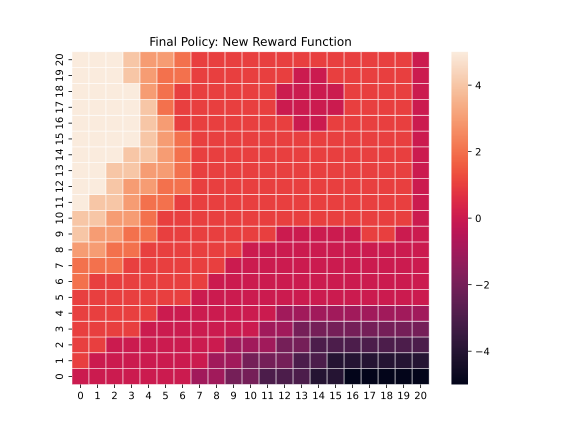
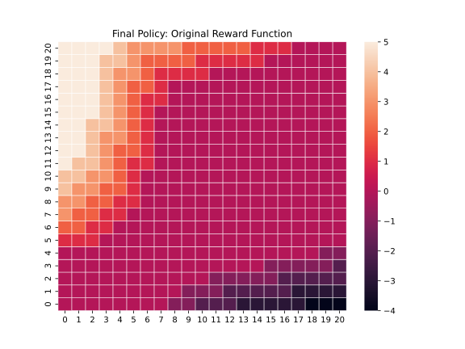

# RL_assignment_1

## Problem 1
For Jack's car problem, we implemented the solution within the same file in a new function called `expected_reward_new`. We also modified the functions for policy optimization to receive a reward function so you can change between the two. To run the code with either function, you should go to the main loop and change the function passed to the policy evaluation and policy improvement functions. The results of both runs can be seen in the plots below. You can see that the non-linearities in the new reward function change the optimal policy, such that now there are times where before you would move cars from one location to another in the previous scenario, and now you don't. This can be seen in the upper-right corner of the new policy. Furthermore, exchanges from A to B are still favored, and in the new policy with the new reward, they are favored even more as the other location often needs more cars, and moving them from A to B is cheaper. Also, moving 0 cars is now done less times as it is often valuable to move cars to avoid paying parking spots.

### Results
#### New Reward Function

#### Original Reward Function

## Problem 2

*Off-Policy Monte Carlo Control with Weighted Importance Sampling*

We implemented Off-Policy Monte Carlo (MC) Control using Weighted Importance Sampling to estimate the optimal policy. The method allows learning an optimal policy while following a different behavior policy, adjusting for discrepancies using importance sampling techniques.

The algorithm follows the Off-Policy MC Control framework, updating action-value estimates 
𝑄(𝑠,𝑎) using weighted returns.
The behavior policy generates episodes, while the target policy is refined over time.
Weighted Importance Sampling corrects for the difference between the behavior and target policies, ensuring unbiased updates.
The algorithm maintains an exploring starts condition to ensure all state-action pairs are visited.
Updates are applied incrementally using ordinary importance sampling and weighted importance sampling.

*Results:*

Policy visualization: Illustrates the optimal actions learned through off-policy MC control.
Q-value estimates: Shows how the action-value function converges over time.
Comparison of sampling methods: Highlights the effects of ordinary vs. weighted importance sampling on policy learning.
